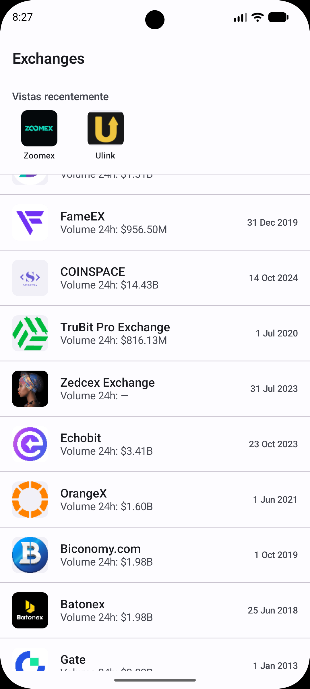
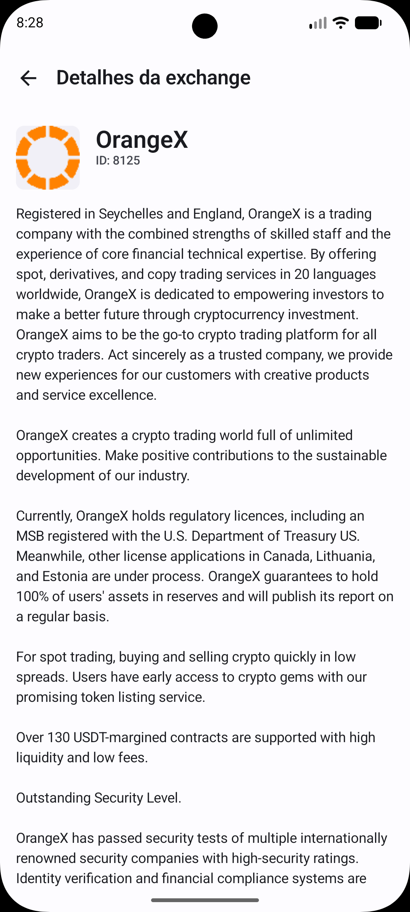
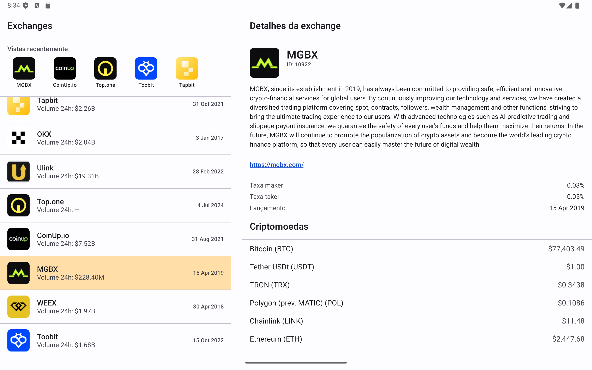
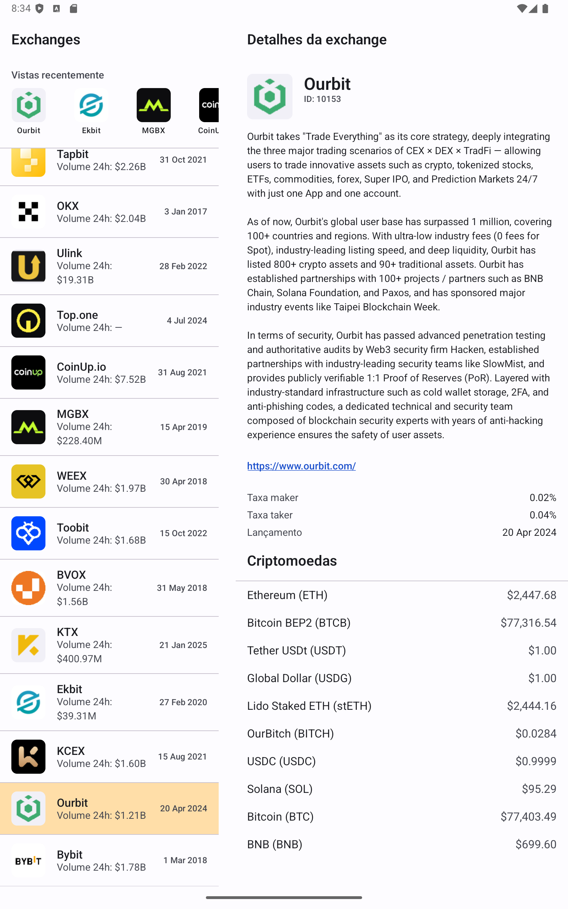

# My MB Challenge

Android app for the [Mercado Bitcoin "Quero ser MB" challenge](https://github.com/mb-desafio/querosermb):
browse cryptocurrency exchanges from the CoinMarketCap API and drill into one exchange's details,
including the cryptocurrencies it reports holding.

<p align="center">
  
  &nbsp;&nbsp;
  
</p>
<p align="center">
  
</p>
<p align="center">
  
</p>

**OBS 1:** I used Claude Code to generate part of the documentation of the project, as well as part
of this Readme and Architecture files.

**OBS 2:** I do not have Mercado Bitcoin image rights. I used the company's logo just as the app icon
and for the scope of this challenge only.

## Stack

Kotlin · Jetpack Compose · Clean Architecture (multi-module) · MVVM · Hilt · Retrofit + Moshi ·
Paging 3 · Room · Coroutines/Flow · JUnit4 + MockK + Truth · Compose UI testing ·
Chucker (debug builds)

See [`docs/ARCHITECTURE.md`](docs/ARCHITECTURE.md) for the module graph, the reasoning behind the
API access pattern, and the error-handling/testing strategy.

## Setup

1. Get a free CoinMarketCap API key at <https://pro.coinmarketcap.com/account> (the app only uses
   endpoints available on the free "Basic" plan: `/v1/exchange/map`, `/v1/exchange/info`,
   `/v1/exchange/assets`).
2. Copy `local.properties.sample` to `local.properties` and fill in `sdk.dir` (your Android SDK
   path) and `CMC_API_KEY`.
3. Open the project in Android Studio (Ladybug or newer) or build from the command line:

   ```bash
   ./gradlew assembleDebug
   ```

The API key is read from `local.properties` at build time into `BuildConfig.CMC_API_KEY`
(`core:network`); it is never hardcoded in source and `local.properties` is gitignored. Building
without a key fails fast with a clear message instead of a mysterious 401 at runtime.

## Debugging network traffic

Debug builds include [Chucker](https://github.com/ChuckerTeam/chucker): every request/response
(headers, body, timing) gets captured and is browsable on-device via a persistent notification, no
proxy or cable needed. Release builds pull in `chucker:library-no-op` instead - same API, empty
implementation - so no HTTP inspection code or UI ships in release at all, not just disabled.

On Android 13+, that notification needs the runtime `POST_NOTIFICATIONS` permission, which the app
requests on first launch (debug builds only). If you deny it, Chucker still captures everything in
the background - you just won't get the notification shortcut, and can instead reach its UI by
granting the permission later in the system app settings.

## Running tests

```bash
./gradlew test                 # unit tests (all modules)
./gradlew connectedAndroidTest # Compose UI tests (needs a running emulator/device)
```

## Feature scope

**Listing screen** - exchanges sorted by 24h spot volume (highest first), showing logo, name,
volume and launch date; infinite scroll with loading/error/retry and empty states.

**Detail screen** - id, description, website, maker/taker fee, launch date, and the list of
cryptocurrencies the exchange reports in its proof-of-reserve wallets (name + USD price). The
exchange record and the asset list load independently and can fail/retry independently too, so a
slow or failing assets request never blanks out exchange info that already loaded fine.

**Recently viewed** - the last 5 exchanges you successfully opened are persisted locally with Room
and shown as a shortcut row above the list, so getting back to one you already looked at doesn't
mean scrolling to find it again. Purely local and offline-friendly, no network round trip - the
row stays visible (with its own empty state) even while the exchange list itself is loading, has
failed, or has nothing to show.

**Adaptive layout** - on a narrow window, tapping an exchange pushes the detail screen over the
list, with a back button. Once the window is wide enough (in practice, a phone rotated to
landscape) it switches to list-on-the-left, detail-on-the-right instead, both visible at once and
split 40/60 so detail gets the extra room its content needs. Rotating never re-fetches data or
resets the list's scroll position either way, because the
exchange list's ViewModel and its scroll state are both hoisted above wherever the one-pane/
two-pane decision gets made - see "Adaptive list-detail layout" in `docs/ARCHITECTURE.md` for
exactly how, plus a note on why width, not orientation, is what decides the breakpoint.

## Notable edge cases handled

- The challenge's obvious source for the listing, `/v1/exchange/listings/latest`, isn't actually
  available on the free API plan - confirmed live, HTTP 403, CMC error code 1006. The listing is
  built from `/v1/exchange/map` (sort + pagination) enriched with `/v1/exchange/info` instead; see
  `docs/ARCHITECTURE.md` for the full story.
- An exchange with no disclosed proof-of-reserve assets (Kraken, at the time of writing) shows a
  distinct empty state, not an error.
- Network failure, rate limiting (CMC error codes 1008/1009/1010), an invalid or missing API key
  (1001/1002), and plan-restricted endpoints (1006) each get their own correct message instead of
  a generic "something went wrong."
- Connectivity is checked proactively, not just reactively: a persistent banner shows whenever the
  device has no validated internet connection, every API call short-circuits to an instant
  `NoConnectivity` error instead of waiting out a connect timeout when there's obviously no
  connection, and requests that failed specifically because of that auto-retry the moment
  connectivity comes back - see "Proactive connectivity" in `docs/ARCHITECTURE.md`.
- Null/blank `logo`, `description`, `date_launched`, and empty `website` arrays all get sensible
  fallbacks instead of crashing or showing "null" on screen.
- Crypto prices span a lot of orders of magnitude - sub-cent tokens next to $100k BTC - so the
  price formatter adapts decimal precision to the value's magnitude instead of rounding small
  prices down to "$0.00".
- The same currency held across multiple proof-of-reserve wallets gets de-duplicated in the assets
  list.
- Rotation and process death: the paged list is cached in the ViewModel
  (`cachedIn(viewModelScope)`) and survives configuration changes without re-fetching.

## Accessibility

Some accessibility support is in place - decorative icons are hidden from screen readers
(`contentDescription = null`), list rows expose a single merged, human-readable description
instead of reading each field separately, and every label goes through `stringResource` rather
than being hardcoded. It's not a full accessibility pass, though - things like live-region
announcements and explicit heading semantics aren't there yet.

## Project structure

```
app/                      Application, MainActivity, adaptive list-detail root screen
core/common/               AppResult, AppError, DispatcherProvider - pure Kotlin, no Android deps
core/network/               Retrofit/OkHttp/Moshi client, API key wiring
core/ui/                    Compose theme, shared state composables, formatters
domain/                     Models, repository interface, use cases - pure Kotlin
data/                       DTOs, CoinMarketCap API, mappers, paging, repository impl, Room DB
feature/exchangelist/       Listing screen
feature/exchangedetail/     Detail screen
docs/                       Architecture notes
```